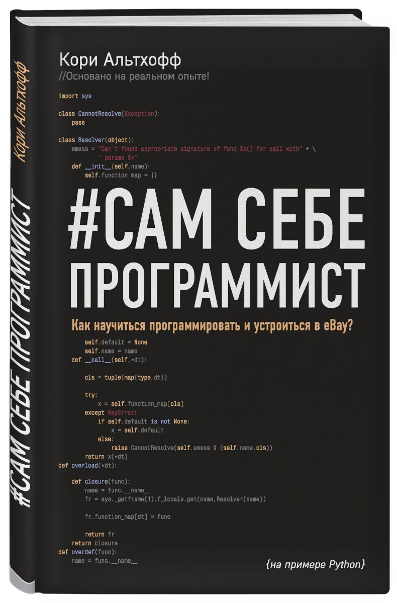

# ТОП книг по программированию на Python

  
  

## Python с нуля
Книги, в которых понятно и доступно изложена информация 
о правилах языка. Есть рабочие примеры, которые можно 
протестировать и задания для самостоятельной практики.
 **Для новичков**   

### 1. #Сам себе программист

|   | 
Как за год научиться программировать и устроиться разработчиком в Ebay?  Автор книги, на собственном опыте знает, что это возможно, и делится знаниями с читателями.  Альтхофф создал универсальный самоучитель, не похожий ни на один другой. На примере языка Python автор показывает, как буквально с первого урока можно приступить к созданию собственной небольшой программы, а к концу книги уверенно писать код. Это прекрасное пособие для тех, кто хочет научиться программировать и планирует заниматься этим профессионально.
 |
|---------------------------------|---------------------------------------------------------------------------------------------------------------------------------------------------------------------------------------------------------------------------------------------------------------------------------------------------------------------------------------------------------------------------------------------------------------------------------------------------------------------------------------------------------------------------------------------------------------------------|

**Возрастные ограничения:** 12+

[Скачать](https://github.com/jonotyan/openlake.guides/blob/main/books/download/yourrself/%D0%9A%D0%BE%D1%80%D0%B8_%D0%90%D0%BB%D1%8C%D1%82%D1%85%D0%BE%D1%84%D1%84_%23%D0%A1%D0%B0%D0%BC_%D1%81%D0%B5%D0%B1%D0%B5_%D0%BF%D1%80%D0%BE%D0%B3%D1%80%D0%B0%D0%BC%D0%BC%D0%B8%D1%81%D1%82.pdf)

## 2 часть
описание
примеры
### возможно подтема
описание
примеры

## ... часть
описание
примеры
### возможно подтема
описание
примеры

## Что дальше и вовзрат на главную раздела
...

## Полезные ссылки
@link
@link
@link
